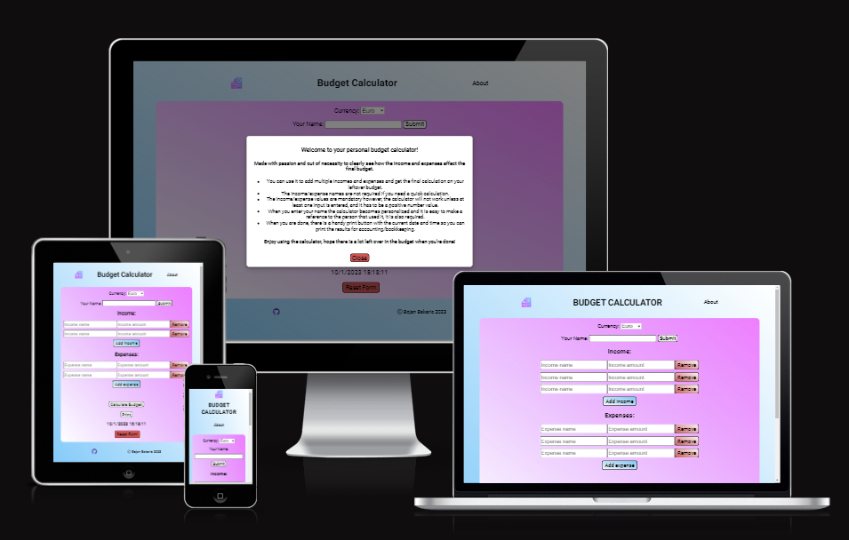
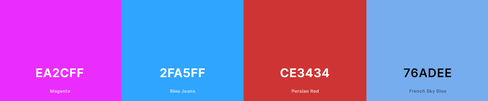

# BUDGET CALCULATOR

Budget Calculator is a Project 2 for Code Institute Full-stack development program: HTML/CSS Essentials.
Made with passion for personal use of the author in the future, and for anyone interested in a clean and fast budgeting option.

Visit the live site [Here.](https://boiann.github.io/budget-calculator "Link to Budget Calculator")

---

## CONTENTS

* [Project Overview](#project-overview)
  * [Project Goals](#project-goals)
  * [User Goals](#user-goals)

* [User Experience](#user-experience)
  * [User Expectations](#user-expectations)
  * [User Stories](#user-stories)

* [Design](#design)
  * [Colour Scheme](#colour-scheme)
  * [Typography](#typography)
  * [Imagery](#imagery)
  * [Structure](#structure)
  * [Wireframes](#wireframes)

* [Features](#features)
  * [Visible Features](#visible-features)
  * [Invisible Features](#invisible-features)
  * [Future Implementations](#future-implementations)

* [Technologies Used](#technologies-used)
  * [Languages Used](#languages-used)
  * [Programs Used](#programs-used)

* [Deployment](#deployment)

* [Testing](#testing)

* [Credits](#credits)
  * [Code used and adapted](#code-used-and-adapted)
  * [Acknowledgments](#acknowledgments)

---

## **Project Overview**
Budget Calculator was created as a great idea to have the project for Project 2 submission and keep the option to use it on a regular basis in the future.
The Author is calculating the budget at the beginning of every month, taking multiple income/expense values into consideration.
Having developed this page, the author feels it will be much easier and nicer to use this webpage then paper.

### **Project Goals**
  * Present the Budget calculator in a clean and easy to understand manner
  * Keep good UX principles regarding layout/colours/interaction
  * Robust javascript code without issues/bugs

### **User Goals**
  * Use the site for intended purpose quickly and intuitively
  * Accessible on multiple devices
  * To be able to find additional info if needed

[Back to top ⇧](#budget-calculator)

---

## **User Experience**

### **User Expectations**
  * Able to quickly understand what the purpose of the site is
  * Find additional info if needed
  * Every interaction has feedback 
  * Fast performance
  * User-friendly

### **User Stories**

  #### **First Time Visitor**
   * I want to know what is this site for
   * I want to find additional info/instructions
   * I want to personalize this site for myself

  #### **Returning User**
   * I want to do some calculations quickly
   * I want to see the author's other work
   * I want to keep the results for later use 

  #### **Website Owner**
   * I want to give a smooth and fast experience
   * I want to use the site regularly
   * I want no bugs or issues

[Back to top ⇧](#budget-calculator)

---

## **Design**

### **Colour Scheme**

The colours used in the page are blue and pink/purple and various shades and opacity values of the same.
For the add/remove buttons the red and blue are used.

This colour choice was directly inspired by the logo image used and the whole page is set up to contrast the two colours using linear gradient diagonally.
Purpose of this was to connect the favicon, logo and the page itself into one cohesive unit always connected with these two colours.

The buttons for adding income/expense are shaded blue with hover effect using darker shade of blue. The remove button for income/expense are shaded red and then darker red on hover.
Other buttons have linear gradient with both pink and blue on hover.

### **Typography**

The fonts were imported from [Google Fonts](https://fonts.google.com/ "Link to Google fonts page") database.
Roboto is used throughout the site, quick google search suggested the font as good option for budgeting needs. 
The font has a back-up font in case the selected doesn't load for the user, sans-serif.

### **Imagery**

The image is used as the logo and favicon.
It was also used as a source for the inspiration for the general colour use through the project.
Source credited in the [Credits](#credits) section of this README and as a tooltip when the user hovers over the logo image.

### **Structure**
  * Budget Calculator website is structured in a user friendly and easy to navigate way.
  * When the page first loads, the user is met with all the info needed for successful budget calculation
  * The title of the page in the header explains what the site is and it's purpose
  * If additional info is needed there is 'About' clickable element where the user would expect it (top right corner), it opens an overlay modal with additional info
  * Modal overlays are implemented to warn the user if anything is wrong/needs to have input before the calculation can take place
  * There is a dropdown menu for currency selection, when it is selected the results will show the currency too
  * The name input is required because it changes the heading of the site to include the user's name
  * The income/expense inputs for name are not mandatory but the values (numbers) are, this is to facilitate quicker calculation if the user needs it
  * There are add/remove buttons for income and expenses, the user can add as many as needed, but cannot remove the first input fields
  * The results of the budget calculation are shown including total income/expenses including the currency selected
  * The print button is below the 'Calculate Budget' button should the user wish to print the page
  * The date and time display is present to keep track of when the user did the calculation, it updates every second
  * The 'Reset Form' button resets the whole page to initial state, clearing all input fields, results and added income/expenses
  * The footer area contains basic copyright and name of the author plus GitHub icon that opens the author's GitHub profile in new tab
 
### **Wireframes**

Wireframes for the project were developed right after the idea for the project was chosen. The actual colour use came later when using the logo/favicon image.

Wireframes for Assessment Guide and Project Planning & Ux were made before the ones for the content of the pages themselves.

Assessment guide wireframe

Project planning wireframe

There are three wireframes for the project, each one corresponding to the level of learning outcome (grade); Pass Performance, Merit Performance and Distinction Performance.

Differences between outcomes were considered early as to allow flexibility when working on the project. Personal, work, family, dependants and health situations were considered to have impact on time available for the project.
Ideally, maximum time was to be taken to finish the project making the scope bigger.

Pass Performance wireframe

Merit Performance wireframe

Distinction Performance wireframe

Mobile wireframe

[Back to top ⇧](#budget-calculator)

---

## **Features**

All of the features presented in this sections are fully responsive on all devices and screen widths.
The break points for media-queries are large to 750 px wide displays, 750 px to 500 px wide displays, and anything under 500 px wide. 
This has been tested for display size of 320 px, but it does work below that limit, up to 295 px width. Please refer to [TESTING.md](/TESTING.md) for more information about responsiveness testing.

### **Visible Features**

* Hover effect on 'About' text in the header and modal opening, modal close button hover effect
<!-- image -->

* Tooltip showing for 'About' and the logo image
<!-- image  -->

* Hover effect on all the buttons present in the page
<!-- image -->

* Hover effect and new tab opening when the user clicks GitHub icon
<!-- image -->

* Currency selector dropdown menu
<!-- image -->

* Name input welcome message and page title change
<!-- image -->

* Add more income/expense input fields
<!-- image -->

* Removal of added income/expense input fields & inability to remove first income/expense input fields
<!-- image -->

* Inability to calculate budget unless the name is entered, modal
<!-- image -->

* Inability to calculate budget unless positive value number is entered in income/expense
<!-- image -->

* Calculate budget button showing results and selected currency
<!-- image -->

* Calculate budget button showing results from multiple income/expenses
<!-- image -->

* Print button working
<!-- image -->

* Time display updates every second
<!-- image -->

* Reset form button resets everything; name, values, added inputs
<!-- image -->

### **Invisible Features** 
* User is unable to enter the letter 'e' using the keyboard. For more information about this solved issue please refer to **Solved Bugs** section of [TESTING.md](/TESTING.md).

### **Future Implementations**
For future implementations, the developer would like to add google pie chart API displaying the total income/expenses as chart value, as well as research what would be useful for other users in regards to budgeting.

[Back to top ⇧](#budget-calculator)

---

## **Technologies Used**

### **Languages Used**

* [HTML](https://en.wikipedia.org/wiki/HTML "Link to html wikipedia page") - The website content was developed using HTML language.
* [CSS](https://en.wikipedia.org/wiki/CSS "Link to css wikipedia page") - The website was styled using custom CSS in an external file.
* [JAVASCRIPT](https://en.wikipedia.org/wiki/JavaScript "Link to javascript wikipedia page") - Used to handle all the functionality, interactions and calculations.

### **Programs Used**

* [GitHub](https://github.com/ "Link to GitHub page") - Source code hosted on GitHub, deployed using Git Pages.
* [GitPod](https://www.gitpod.io/ "Link to GitPod page") - Used to commit, comment and push code during the development process.
* [Font Awesome](https://fontawesome.com/ "Link to Font Awesome page") - GitHub icon was obtained from Font Awesome.
* [Balsamiq](https://balsamiq.com/ "Link to Balsamiq page") - Used to create wireframes and website structure map for the project.
* [Visual Studio Code + Spell Checker add on](https://code.visualstudio.com/ "Link to Visual Studio page") - Used to spell-check the html and css code
* [Google Keep](https://keep.google.com/ "Link to Google Keep page") - Used to make notes during the project duration
* [LanguageTool](https://languagetool.org/ "Link to Language Tool page") - Used to spell-check the contents of README.md
* [Google Fonts](https://fonts.google.com/ "Link to Google fonts page") - Used to import fonts to the project
* [GifCap](https://gifcap.dev/ "Link to GifCap page") - used to capture gif-s of the project 

[Back to top ⇧](#budget-calculator)

---

## **Deployment**

This project was developed using [GitPod](https://www.gitpod.io/ "Link to GitPod site"), which was then committed and pushed to GitHub using the GitPod terminal.

### **Deploying on GitHub Pages**
To deploy this page to GitHub Pages from its GitHub repository, the following steps were taken:

1. Log into [GitHub](https://github.com/login "Link to GitHub login page") or [create an account](https://github.com/join "Link to GitHub create account page").
2. Locate the [GitHub Repository](https://github.com/Boiann/budget-calculator "Link to GitHub Repository").
3. At the top of the repository, select Settings from the menu items.
4. Scroll down the Settings page to the "Pages" section.
5. Under "Source" click the drop-down menu labelled "None" and select "Main".
6. Upon selection, the page will automatically refresh meaning that the website is now deployed.
7. Scroll back down to the "Pages" section to retrieve the deployed link.

[Back to top ⇧](#budget-calculator)

---

## **Testing**

Testing information can be found in a separate testing file [TESTING.md](/TESTING.md).

[Back to top ⇧](#budget-calculator)

---

## **Credits**

### **Code used and adapted**

* The author used his previous project, [Boudoir Studio](https://boiann.github.io/boudoir-studio/index.html "Link to Boudoir Studio home page") ( GithHub repository [here](https://boiann.github.io/boudoir-studio/index.html "Link to Boudoir Studio home page") ), as a source for looking up the code for CSS and README purposes.
* [Favicon and logo image](https://www.flaticon.com/free-icon/budgeting_9320681?term=budget&page=3&position=60&origin=search&related_id=9320681)
* [CSS gradient](https://www.w3schools.com/css/css3_gradients.asp)
* [Block input of letter 'e'](https://stackoverflow.com/questions/39291997/how-to-block-e-in-input-type-number)
* [Modals](https://www.w3schools.com/howto/howto_css_modals.asp)

### **Websites visited to gather knowledge**

There were many sites visited during the duration of the project.
[Google](https://google.com/ "Google home page") was used to produce results of the specific query, and [Stack Overflow](https://stackoverflow.com/ "Stack Overflow home page") proved to be the best source of information for various queries/issues. The website that was of immense help and served as a guide was [Learn Javascript](https://www.codecademy.com/learn/introduction-to-javascript/modules/learn-javascript-introduction/cheatsheet "Link to Learn Javascript on CodeAcademy") that was almost always open in a tab of the browser.

  
###  **Acknowledgments**
Without support I got from other people, this project would never be realized. I'll try and remember to thank everyone and everything I can!

* Mirjana, my wife, thank you for your support and cheering me on, lifting me 
back up when it got hard. Thank you for taking care of all the housework and food, children and numerous other responsibilities while I was busy with full time job and doing this project on the side. Without you this journey into career change would never be possible.
* A., G. and V., my three beautiful girls. Thank you for being so understanding during the project. Thank you from the bottom of my heart for being who you are, wonderful and delightful souls. You make me proud to be your dad.
* Boris and Maja, my brother and sister, thank you for testing my project so thoroughly, and for your support.
* Marija and Boris, my mother and father, thank you for making me feel like a superstar when I announced I'm starting this journey.
* John, my friend, thank you for starting me on this path, and for your support, chats and sharing the things you learned.
* Helen from Code Institute, thank you believing in me and making this change possible.
* Slack community, thank you for being a constant source of good information.
* Koko, my mentor, thank you for being an incredible source of solutions and good advice, your support meant a great deal during the project.
* C8H10N4O2 in a cup. Thank you for existing.

[Back to top ⇧](#budget-calculator)

***